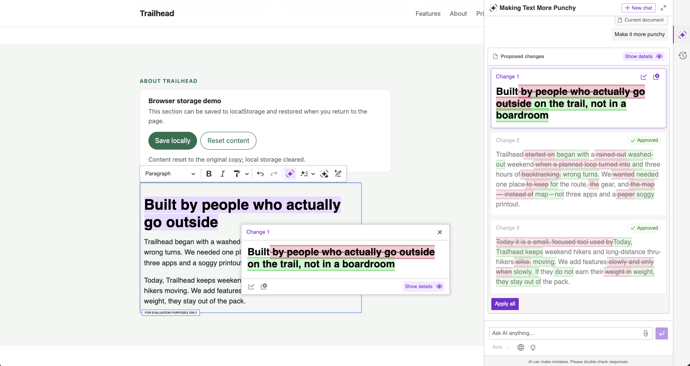

# Trailhead — CKEditor AI coding-agent demo

This repository is a small, runnable showcase for a webinar about integrating
CKEditor with AI coding agents. The companion event is available on the
[webinar event page](https://app.zuddl.com/p/a/event/1940c878-402a-4801-9239-b0aad2ff95ed).

The app is a fictional Trailhead backcountry trip-planning landing page. Most
of the page is fixed marketing content; the **About Trailhead** section is the
demo surface for CKEditor.



## What the demo shows

- A vanilla JavaScript `InlineEditor` embedded in the About section.
- CKEditor's model-based editing pipeline instead of direct DOM HTML editing.
- Premium Format painter and Slash commands.
- CKEditor AI integration when an AI token endpoint is configured.
- HTML persistence through CKEditor `editor.getData()` and `localStorage`.
- Autosave after one second of inactivity, with restoration on page load.
- Explicit **Save locally** and **Reset content** controls with status feedback.
- Reset through `editor.setData()` while clearing the stored autosave entry.

This is intentionally a demo, not a production content-management system.
There is no backend, authentication, multi-user persistence, or server-side
content storage. Browser storage belongs only to the current browser profile.

## Run it

Requires Node.js and npm.

```bash
npm install
cp .env.example .env
npm run dev
```

Open the local URL printed by Vite (normally
`http://127.0.0.1:8080` or `http://localhost:8080`). A production build can be
checked with:

```bash
npm run build
```

## Environment

`.env` is ignored by Git. Copy `.env.example` and provide the values supplied
by CKEditor:

```dotenv
VITE_CKEDITOR_LICENSE_KEY=<YOUR_CKEDITOR_LICENSE_KEY>
VITE_CKEDITOR_AI_TOKEN_URL=<YOUR_CKEDITOR_AI_TOKEN_URL>
```

The license key is passed to CKEditor. The AI plugins and AI toolbar actions
are enabled only when `VITE_CKEDITOR_AI_TOKEN_URL` is present; without it, the
editor still runs with the core and other configured features, and logs a
warning explaining why AI is disabled.

## Project shape

- `index.html` — the landing page and the editable `#editable-about` region.
- `about-editor.js` — CKEditor imports, configuration, AI setup, autosave,
  localStorage restoration, and the demo controls.
- `styles.css` — landing-page styling and the browser-storage demo panel.
- `script.js` — small non-editor page behavior such as the footer year.
- `package.json` — npm dependencies and Vite `dev`/`build` scripts.

The editor uses the `ckeditor5` and `ckeditor5-premium-features` npm packages at
the same version. CKEditor CSS is imported from both packages in
`about-editor.js`.

## How this demo was built with AI coding agents

The repository is also a record of an incremental agent-assisted integration.
The important lesson is to give the agent project context and let the official
CKEditor skill keep installation and configuration details current.

### Try the flow yourself

To reproduce the integration from the clean starting point, check out the
starter commit first:

```bash
git checkout c64cd9b
```

Then open the project with the AI coding agent of your choice and work through
the prompts below. You can use Codex, Claude Code, Cursor, GitHub Copilot,
Windsurf, or another agent that supports the open Agent Skills format. The
repository's `.agents/skills/ckeditor/` directory and the documented CKEditor
MCP setup are there to give the agent current integration guidance.

### 1. Start with the architectural requirements

The initial request established the selection criteria: a real WYSIWYG editor
with an abstract document model between content and the DOM, enterprise
features, AI-generated rich HTML, collaboration, comments, track changes,
revision history, export, and strong reliability. That led to CKEditor as
the single editor recommendation.

### 2. Ask how an AI coding agent should use CKEditor

The next prompt asked the agent to check the latest CKEditor documentation and
explain whether official support exists for choosing an installation method,
wiring the editor, mapping features, loading styles, and keeping configuration
current. The answer identified the official CKEditor agent skill and the
documentation MCP server.

CKEditor documents this workflow in [Using CKEditor with AI coding
agents](https://ckeditor.com/docs/ckeditor5/latest/getting-started/ai-coding-agents.html).
The page explains that the skill can choose npm/CDN/ZIP, wire vanilla JS or
official framework integrations, configure plugins and styles, set licensing,
and consult version-specific documentation instead of guessing.

### 3. Install the agent support

The prompts used to install the support were:

```text
npx skills add ckeditor/skills
```

```text
codex mcp add ckeditor5-docs --url https://ckeditor5.mcp.kapa.ai
```

The skill is kept locally in `.agents/skills/ckeditor/`, while the MCP server
provides an optional live documentation search endpoint for the coding agent.

### 4. Integrate the editor into the existing page

The implementation prompt was:

```text
This is a vanilla JavaScript landing page (npm project, no framework). Use the
CKEditor skill to make the hero "About" section of index.html editable inline:
the heading and the paragraphs. Install CKEditor via npm. Enable premium
productivity features: Format painter, Slash commands, and CKEditor AI. Do not
change anything outside that section.
```

The result was an npm/Vite integration using `InlineEditor`, core CKEditor
plugins, premium productivity plugins, imported editor CSS, and environment-
based license and AI configuration.

### 5. Resolve configuration errors through the agent

When the first AI configuration needed runtime values, the browser reported
`ai-missing-token` and then `ai-missing-channel-id`. The follow-up prompts were:

```text
extract the logic to js please
```

```text
extract the KEYS to env variables and prepare the .env template and .env file
- ignore the .env file
```

That moved editor setup out of inline HTML and kept secrets out of version
control. The current source reads `VITE_CKEDITOR_LICENSE_KEY` and
`VITE_CKEDITOR_AI_TOKEN_URL` from Vite's environment.

### 6. Add browser-local persistence

The persistence prompt was:

```text
Persist the editor content to localStorage with autosave and restore it on page
load.
```

The agent added CKEditor `Autosave`, stores HTML under
`trailhead:about-html`, restores it through `root.initialData`, and saves the
current editor output with `editor.getData()`.

### 7. Make persistence visible in the demo

The final UI prompt was:

```text
Add a small "Browser storage demo" panel right above the editable About region
that makes the persistence visible and explains it: a short heading, one
sentence saying the section can be saved to localStorage and restored, a "Save
locally" button, a "Reset content" button, and a status line that reports what
just happened. Save must store the current editor content using editor.getData();
Reset must restore the original About content using editor.setData(), clear the
stored copy (including the existing autosave entry), and update the status line.
Match the page's existing styles and integrate cleanly with the autosave that is
already in place. The dev server is already running at http://127.0.0.1:8080 —
do not start your own.
```

This produced the visible storage panel above `#editable-about`. Reset also
suppresses the autosave generated by `setData()` so clearing localStorage is
not immediately undone.

## Useful references

- [CKEditor with AI coding agents](https://ckeditor.com/docs/ckeditor5/latest/getting-started/ai-coding-agents.html)
- [Getting and setting CKEditor data](https://ckeditor.com/docs/ckeditor5/latest/getting-started/setup/getting-and-setting-data.html)
- [CKEditor Autosave](https://ckeditor.com/docs/ckeditor5/latest/features/autosave.html)
- [CKEditor documentation MCP](https://ckeditor5.mcp.kapa.ai)
- [Trailhead webinar showcase event](https://app.zuddl.com/p/a/event/1940c878-402a-4801-9239-b0aad2ff95ed)
